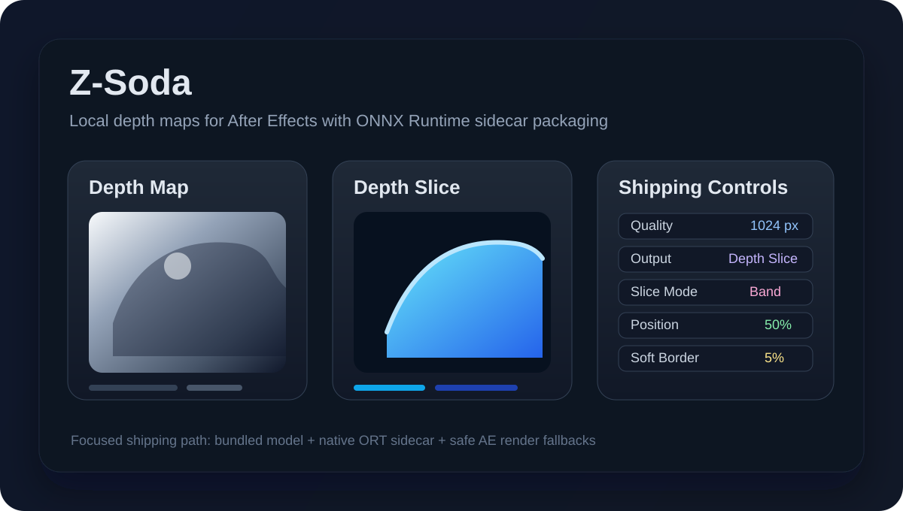
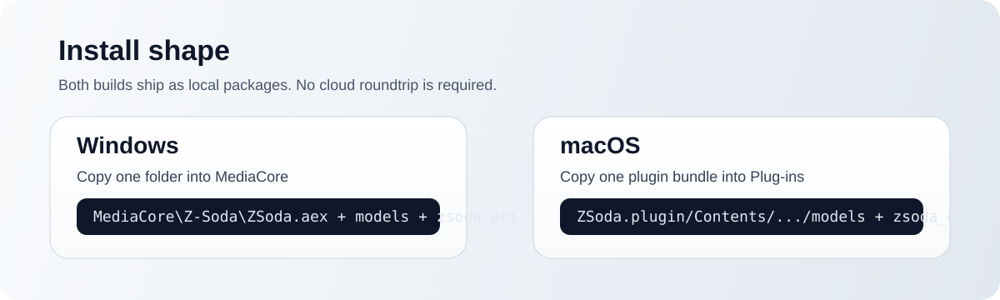

# Z-Soda

Local depth maps for After Effects.



Z-Soda is an After Effects effect plug-in built around a single production-minded path:

- local inference only
- native ONNX Runtime sidecar packaging
- one shipping model: `distill-any-depth-base`
- two outputs: `Depth Map` and `Depth Slice`

## Why This Repo Exists

Z-Soda focuses on a simple install story and a predictable runtime shape.
The current public build avoids giant embedded binaries and keeps the plug-in
layout explicit:

- small `.aex` / `.plugin`
- bundled model folder
- bundled ORT runtime sidecar
- safe render fallbacks instead of host crashes

## Supported Platforms

| Platform | Status | Runtime path | Notes |
| --- | --- | --- | --- |
| Windows | Beta-tested | ONNX Runtime + DirectML sidecar | Recommended |
| macOS Apple Silicon | Beta-tested | ONNX Runtime + CoreML/CPU sidecar | Recommended |
| macOS Intel | Not supported yet | None | Not part of the current shipping target |

Beta validation was done against the current After Effects 2026 cycle.

## Installation



### Windows

1. Quit After Effects.
2. Download the latest Windows package from [Releases](https://github.com/damagethundercat/Z-Soda/releases).
3. Unzip it.
4. Copy the `Z-Soda` folder into:
   `C:\Program Files\Adobe\Common\Plug-ins\7.0\MediaCore\`
5. Launch After Effects and apply `Z-Soda` to a footage layer.

### macOS

1. Quit After Effects.
2. Download the latest macOS package from [Releases](https://github.com/damagethundercat/Z-Soda/releases).
3. Unzip it.
4. Copy `ZSoda.plugin` into your After Effects `Plug-ins` folder.
5. Launch After Effects and apply `Z-Soda`.

If macOS blocks a downloaded build, clear the quarantine flag:

```bash
xattr -dr com.apple.quarantine ZSoda.plugin
```

## What You Get

### Depth Map

Generates a normalized per-pixel depth result for grading, fog, focus, or 2.5D compositing.

### Depth Slice

Turns a depth range into a matte so you can isolate foreground, background, or a narrow depth band.

## Controls

| Control | What it does |
| --- | --- |
| `Quality` | Sets the real inference resolution. Higher values improve detail but take longer. |
| `Preserve Ratio` | Keeps the source aspect ratio during inference. |
| `Output` | Switches between `Depth Map` and `Depth Slice`. |
| `Color Map` | Changes how the depth map is visualized. |
| `Slice Mode` | Chooses whether the slice targets `Near`, `Far`, or a `Band`. |
| `Position (%)` | Moves the slice center or threshold along the depth range. |
| `Range (%)` | Widens or narrows the active slice band. |
| `Soft Border (%)` | Softens the edge of the slice matte. |

## Package Layout

### Windows

```text
Z-Soda/
  ZSoda.aex
  models/
    distill-any-depth/
      distill_any_depth_base.onnx
  zsoda_ort/
    onnxruntime.dll
    onnxruntime_providers_shared.dll
    DirectML.dll
```

### macOS

```text
ZSoda.plugin/
  Contents/
    MacOS/
      ZSoda
    Resources/
      models/
      zsoda_ort/
```

## Repository Layout

- [plugin/ae](plugin/ae): AE entry point, parameter wiring, host bridge
- [plugin/core](plugin/core): render pipeline, cache, frame transforms
- [plugin/inference](plugin/inference): ORT backend, model/runtime resolution
- [tests](tests): unit and integration coverage
- [tools](tools): build, packaging, and staging helpers
- [models/models.manifest](models/models.manifest): shipped model manifest

## Building From Source

You need:

- Adobe After Effects SDK
- CMake
- a C++ toolchain for your platform
- ONNX Runtime SDK/runtime files for the target platform

Primary entry points:

- Windows: `tools/build_aex.ps1`
- macOS: `tools/build_plugin_macos.sh`
- Shared packaging helpers:
  - `tools/prepare_ort_sidecar_release.py`
  - `tools/package_plugin.ps1`
  - `tools/package_plugin.sh`

## Current Scope

Z-Soda intentionally ships one narrow product path:

- one primary model family
- no cloud dependency
- ORT-first runtime
- sidecar packaging instead of giant embedded payloads

That constraint is deliberate. It keeps the plug-in easier to install, debug, and ship.
